# :globe_with_meridians: Praktikum 7 : Relasi One-to-Many dan Many-to-Many
Dibawah ini merupakan langkah pengerjaan praktikum serta hasil screenshot pengerjaan Praktikum Modul 7 saya mengenai Relasi One-to-Many dan Many-to-Many.

## :scroll: Dasar Teori
* ### Relasi
    Hubungan antar tabel yang dilakukan dengan pencocokan primary key dengan foreign key untuk mengombinasikan data dari satu tabel dengan tabel lainnya.
* ### Foreign Key
    Properti yang digunakan untuk menandai hubungan dua tabel atau lebih. Foreign key pada tabel anak (child) akan menunjuk tabel induk (parent) yang menjadi referensinya (reference).
* ### One-to-Many
    Relasi yang menunjukkan hubungan antar tabel dimana baris pada tabel induk dapat terhubung dengan satu atau lebih baris di tabel anak. Sementara baris pada tabel anak hanya dapat terhubung dengan satu baris di tabel induk. 
    
    Contoh penerapan one-to-many
    - Satu tutorial dapat memiliki banyak komentar, namun satu komentar hanya dapat berada di satu tutorial
    - Satu dosbing dapat memiliki banyak mahasiswa, namun mahasiswa hanya dapat dibimbing satu dosen
* ### Many-to-Many
    Relasi yang menunjukkan hubungan antar tabel dimana baris pada tabel induk dapat terhubung dengan satu atau lebih baris di tabel anak. Berlaku sebaliknya pada tabel anak yang dapat terhubung dengan satu atau lebih baris di tabel induk.

    Contoh penerapan many-to-many
    - Satu mahasiswa dapat mengambil banyak mata kuliah, namun satu mata kuliah dapat diambil banyak mahasiswa
    - Postingan dapat memiliki banyak tag, namun satu tag dapat dimiliki banyak postingan.
* ### Junction Table
    Tabel yang digunakan untuk mengatur kombinasi baris pada relasi many-to-many. Junction table berisi foreign key dari kedua tabel yang memiliki relasi many-to-many. 
    
    Contoh penerapan junction table adalah tabel Enrollment pada relasi many-to-many di atas
    
## :footprints: Langkah Percobaan
* ### Pembuatan Table 
    Berikut adalah tabel yang akan digunakan pada percobaan ini
    | posts | *comments* | tags | post_tag |
    | ----------- | ----------- | ----------- | ----------- |
    | id | id | id | postId |
    | content (STRING) | review (STRING) | name | tagId |

1. Sebelum membuat migrasi database atau membuat tabel pastikan server database aktif kemudian pastikan sudah membuat database dengan nama `lumenpost`
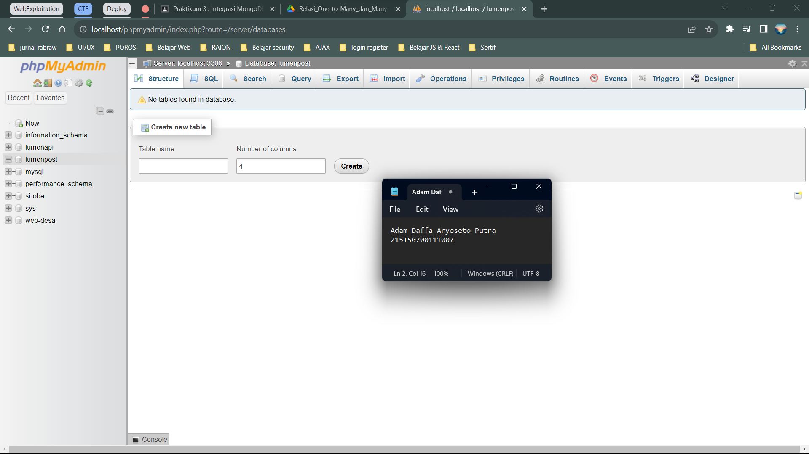

2. Kemudian ubah konfigurasi database pada file .env menjadi seperti berikut
    ```
    DB_CONNECTION=mysql
    DB_HOST=127.0.0.1
    DB_PORT=3306
    DB_DATABASE=lumenpost
    DB_USERNAME=root
    DB_PASSWORD=
    ```
    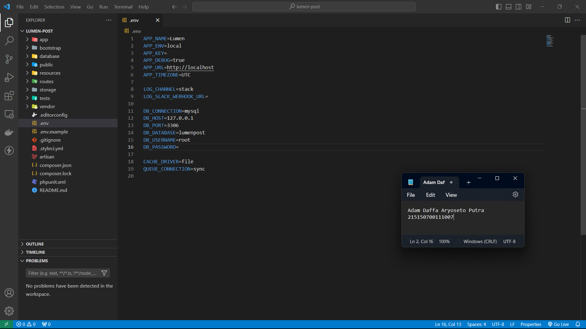
3. Setelah mengubah konfigurasi pada file .env, kita juga perlu menghidupkan beberapa library bawaan dari lumen dengan membuka file app.php pada folder bootstrap dan mengubah baris ini
    ```
    // $app->withFacades();
    // $app->withEloquent();
    ```
    menjadi 

    ```
    $app->withFacades();
    $app->withEloquent();
    ```
    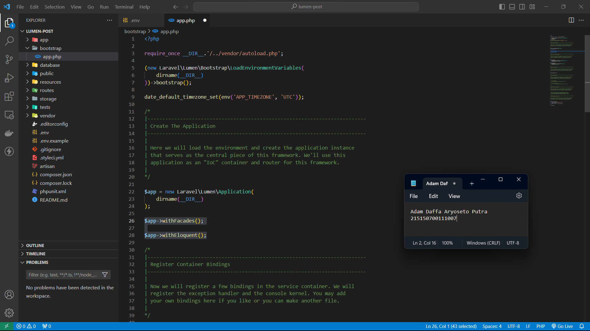
4. Setelah itu jalankan command berikut untuk membuat file migration
    ```
    php artisan make:migration create_posts_table
    php artisan make:migration create_comments_table
    php artisan make:migration create_tags_table
    php artisan make:migration create_post_tag_table
    ```
    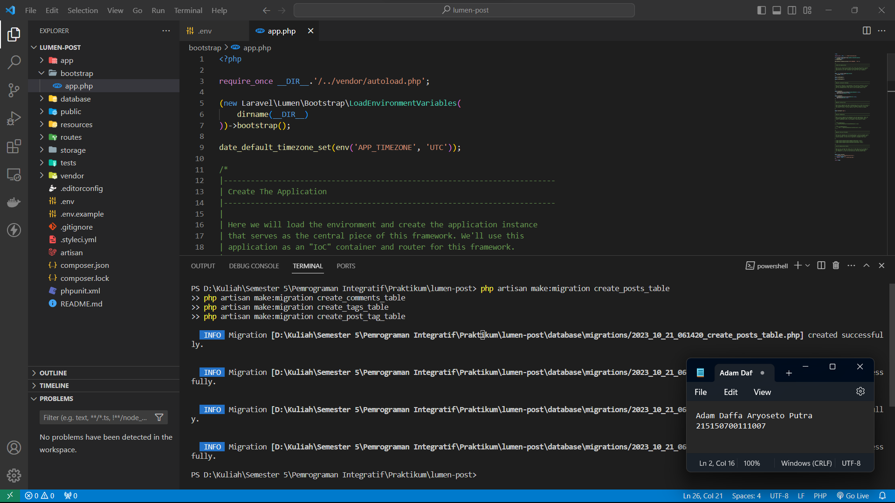
5. Ubah fungsi `up()` pada file `migrasi create_posts_table`
    ```
    #sebelumnya
    ...
    public function up()
    {
        Schema::create('posts', function (Blueprint $table) {
            $table->id();
            $table->timestamps();
        });
    }
    ...
    #diubah menjadi
    ...
    public function up()
    {
        Schema::create('posts', function (Blueprint $table) {
            $table->id();
            $table->timestamps();
            $table->string('content');
        });
    }
    ...
    ```
    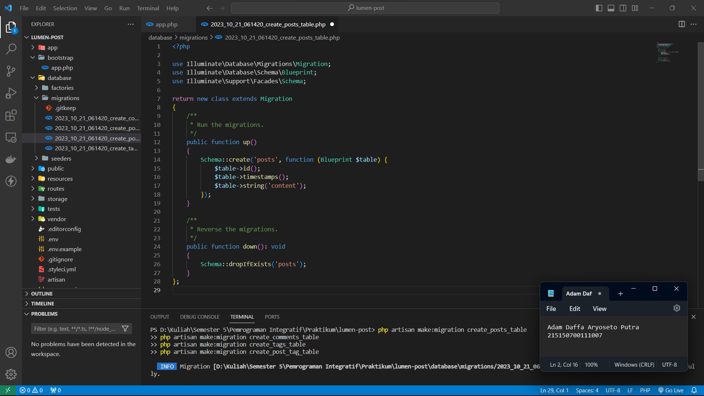
6. Ubah fungsi `up() `pada file `create_comments_table`
    ```
        #sebelumnya
        ...
        public function up()
        {
            Schema::create('comments', function (Blueprint $table) {
                $table->id();
                $table->timestamps();
            });
        }
        ...
        #diubah menjadi
        ...
        public function up()
        {
            Schema::create('comments', function (Blueprint $table) {
                $table->id();
                $table->timestamps();
                $table->string('review');
                $table->foreignId('postId')->unsigned();
            });
        }
        ...
    ```
    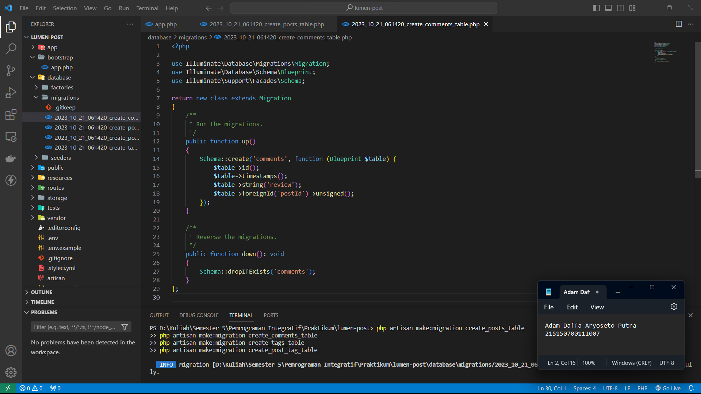
7. Ubah fungsi `up()` pada file `create_tags_table`
    ```
    #sebelumnya
    ...
    public function up()
    {
        Schema::create('tags', function (Blueprint $table) {
            $table->id();
            $table->timestamps();
        });
    }
    ...
    #diubah menjadi
    ...
    public function up()
    {
        Schema::create('tags', function (Blueprint $table) {
            $table->id();
            $table->timestamps();
            $table->string('name');
        });
    }
    ...
    ```
    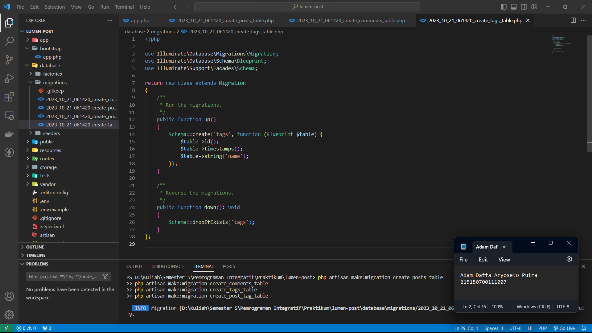
8. Ubah fungsi `up()`pada file `create_post_tag_table`
    ```
    #sebelumnya
    ...
    public function up()
    {
        Schema::create('post_tag', function (Blueprint $table) {
            $table->id();
            $table->timestamps();
        });
    }
    ...
    #diubah menjadi
    ...
    public function up()
    {
        Schema::create('post_tag', function (Blueprint $table) {
            $table->id();
            $table->timestamps();
            $table->foreignId('postId')->unsigned();
            $table->foreignId('tagId')->unsigned();
        });
    }
    ...
    ```
    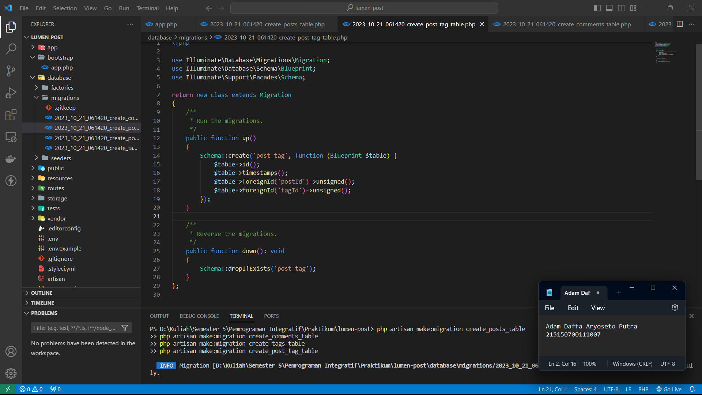
9. Kemudian jalankan command
    ```
    php artisan migrate
    ```
    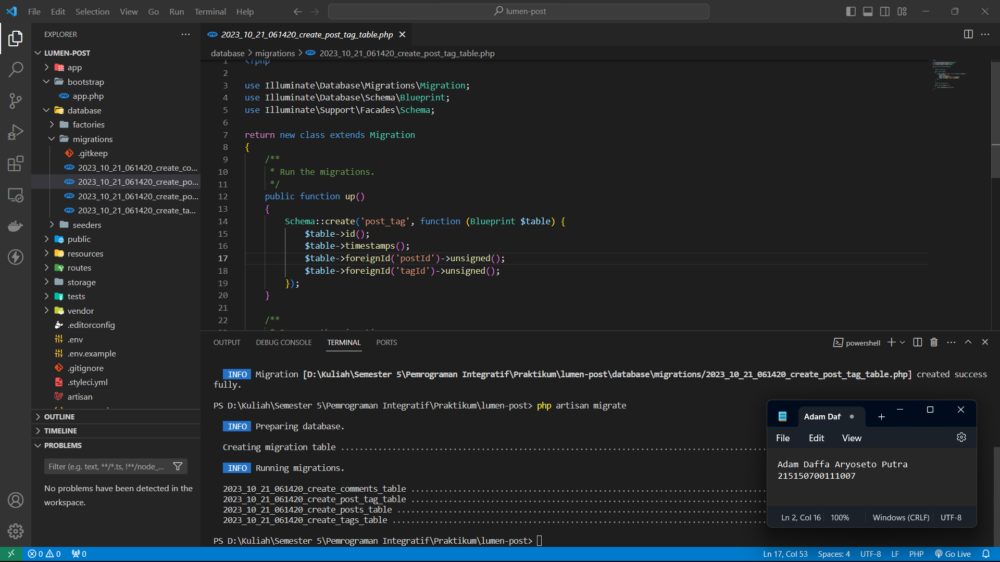
    
* ### Pembuatan Model
1. Buatlah file dengan nama Post.php dan isi dengan baris kode berikut
    ```
    <?php

    namespace App\Models;

    use Illuminate\Database\Eloquent\Model;

    class Post extends Model
    {
        /**
        * The attributes that are mass assignable.
        *
        * @var string[]
        */
        protected $fillable = [
            'content'
        ];

        /**
        * The attributes excluded from the model's JSON form.
        *
        * @var string[]
        */
        protected $hidden = [];
    }
    ```
    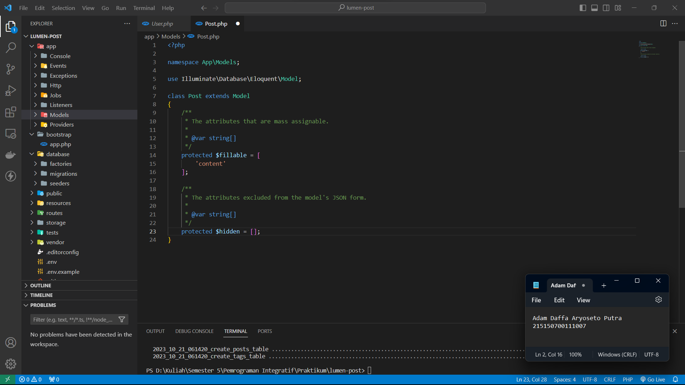
2. Buatlah file dengan nama Comment.php dan isi dengan baris kode berikut
    ```
    <?php

    namespace App\Models;
   
    use Illuminate\Database\Eloquent\Model;
    
    class Comment extends Model
    {
        /**
         * The attributes that are mass assignable.
         *
         * @var string[]
         */
        protected $fillable = [
            'review'
        ];
        
        /**
         * The attributes excluded  from the model's JSON form.
         *
         * @var string[]
         */
        protected $hidden = [];
    }
    ```
    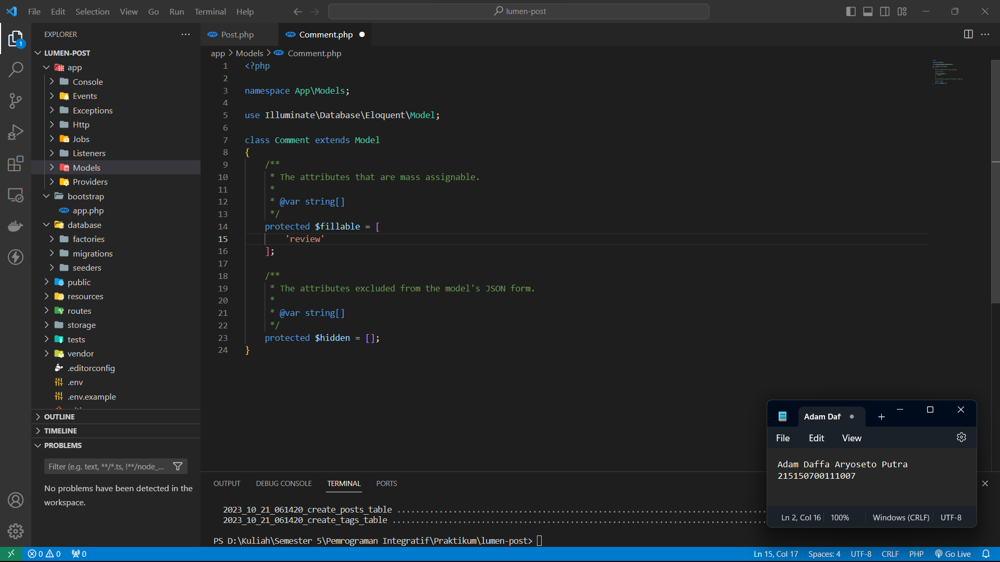
3. Buatlah file dengan nama Tag.php dan isi dengan baris kode berikut
    ```
    <?php
    namespace App\Models;
    use Illuminate\Database\Eloquent\Model;
    class Tag extends Model
    {
        /**
        * The attributes that are mass  assignable.
        *
        * @var string[]
        */
        protected $fillable = [
            'name'
        ];

        /**
        * The attributes excluded from  the model's JSON form.
        *
        * @var string[]
        */
        protected $hidden = [];
    }
    ```
    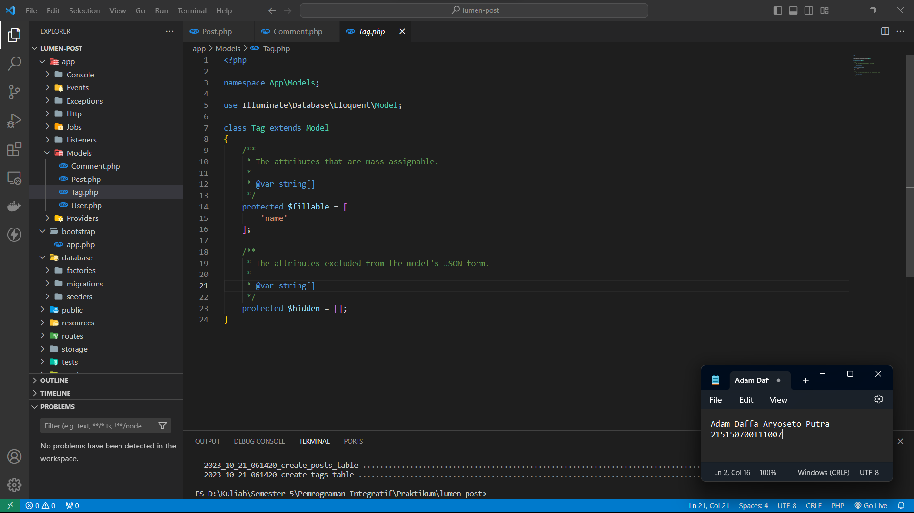

* ### Relasi One-to-Many
1. Tambahkan fungsi comments() pada file Post.php
    ```
    <?php

    namespace App\Models;

    use Illuminate\Database\Eloquent\Model;

    class Post extends Model
    {
        ...
        // fungsi comments
        public function comments()
        {
            return $this->hasMany(Comment::class, 'postId');
        }
    }
    ```
    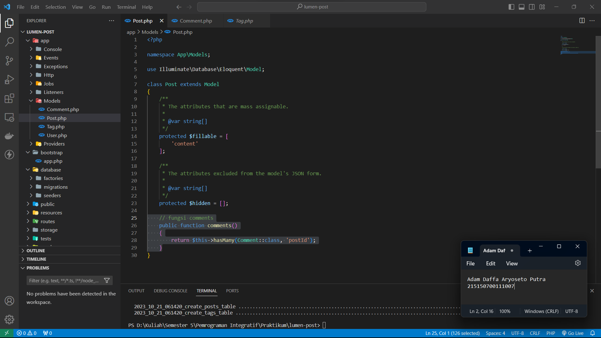
2. Tambahkan fungsi post() dan atribut postId pada $fillable pada file Comment.php
    ```
    <?php

    namespace App\Models;

    use Illuminate\Database\Eloquent\Model;

    class Comment extends Model
    {
        ...
        protected $fillable = [
            'review',
            'postId' // atribut postId
            ];

        /**
         * The attributes excluded from the model's JSON form.
         *
         * @var string[]
         */
        protected $hidden = [];

        public function post()
        {
            return $this->belongsTo(Post::class, 'postId');
        }
    }
    ```
    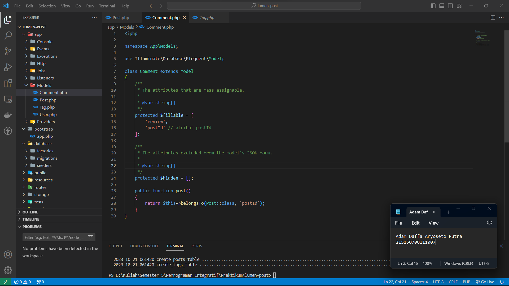
3. Buatlah file PostController.php dan isilah dengan baris kode berikut
    ```
    <?php

    namespace App\Http\Controllers;

    use App\Models\Post;
    use Illuminate\Http\Request;

    class PostController extends Controller
    {
        /**
        * Create a new controller instance.
        *
        * @return void
        */
        public function __construct()
        {
            //
        }
        
        //
        public function createPost(Request $request)
        {
            $post = Post::create([
                'content' => $request->content,
            ]);
            return response()->json([
                'success' => true,
                'message' => 'New post created',
                'data' => [
                    'post' => $post
                ]
            ]);
        }
        public function getPostById(Request $request)
        {
            $post = Post::find($request->id);
            
            return response()->json([
                'success' => true,
                'message' => 'All post grabbed',
                'data' => [
                    'post' => [
                        'id' => $post->id,
                        'content' => $post->content,
                        'comments' => $post->comments,
                    ]
                ]
            ]);
        }
    }
    ```
    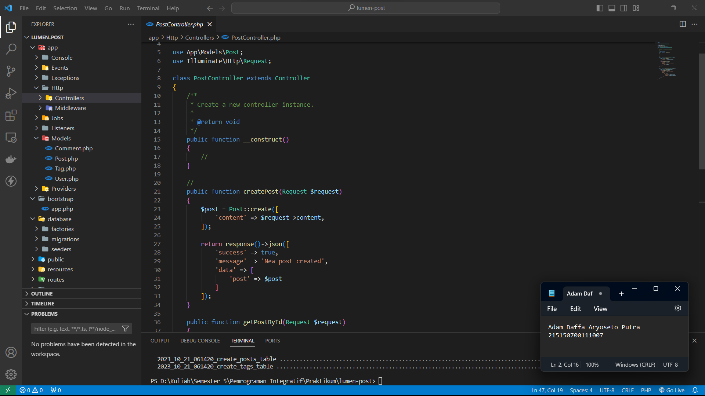
4. Buatlah file CommentController.php dan isilah dengan baris kode berikut
    ```
    <?php

    namespace App\Http\Controllers;

    use App\Models\Comment;
    use Illuminate\Http\Request;

    class CommentController extends Controller
    {
        /**
        * Create a new controller instance.
        *
        * @return void
        */
        public function __construct()
        {
            //
        }

        //
        public function createComment(Request $request)
        {
            $comment = Comment::create([
                'review' => $request->review,
                'postId' => $request->postId,
            ]);
            
            return response()->json([
                'success' => true,
                'message' => 'New comment created',
                'data' => [
                    'comment' => $comment
                ]
            ]);
        }
    }
    ```
    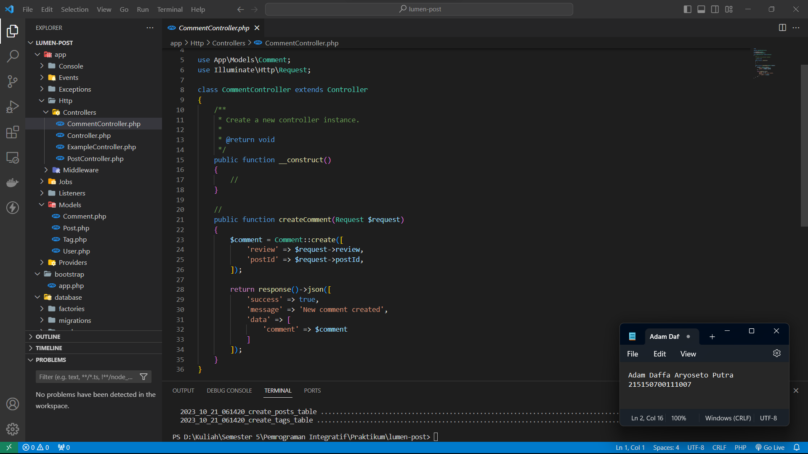
5. Tambahkan baris berikut pada routes/web.php
    ```
    <?php
    ...
    $router->group(['prefix' => 'posts'], function () use ($router) {
        $router->post('/', ['uses' => 'PostController@createPost']);
        $router->get('/{id}', ['uses' => 'PostController@getPostById']);
    });

    $router->group(['prefix' => 'comments'], function () use ($router) {
        $router->post('/', ['uses' => 'CommentController@createComment']);
    });
    ```
    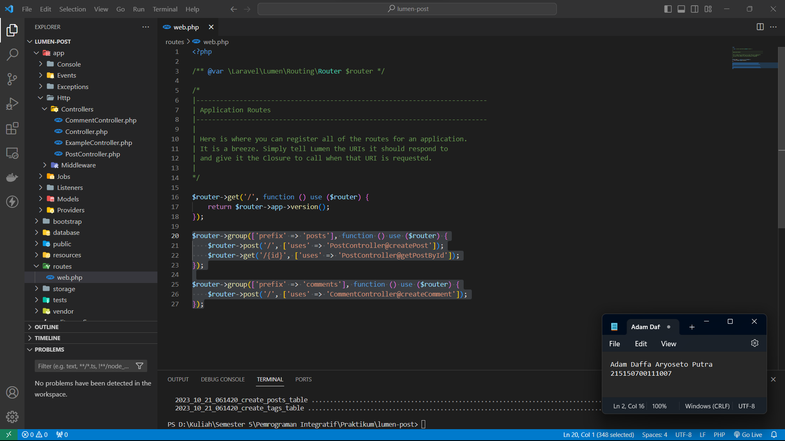
6. Buatlah satu post menggunakan Postman
    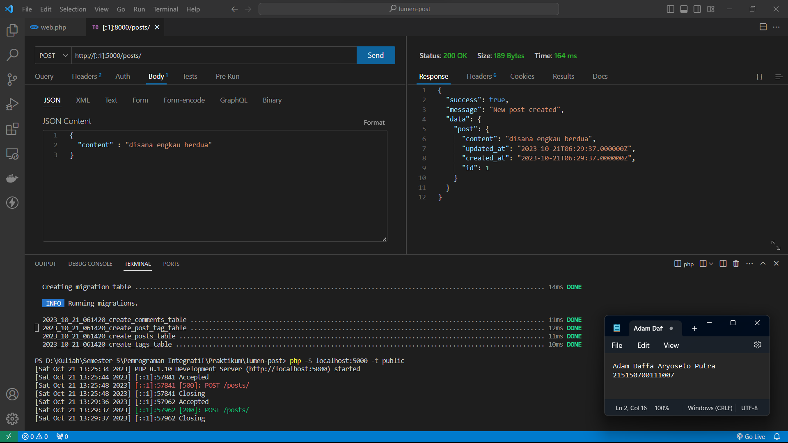
7. Buatlah satu comment menggunakan Postman
    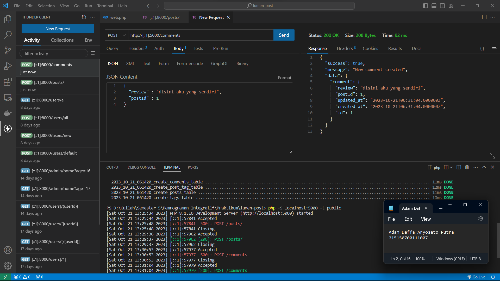
8. Tampilkan post menggunakan Postman
    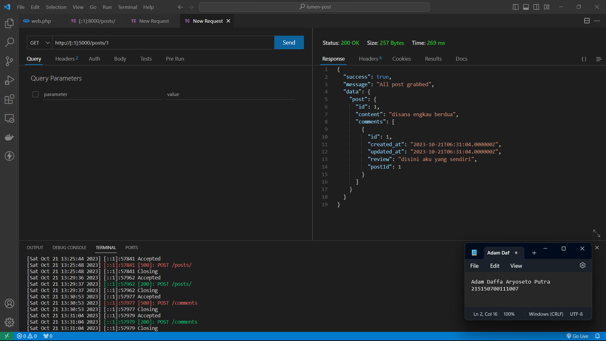

* ### Relasi Many-to-Many
1. Tambahkan fungsi tags() pada file Post.php
    ```
    <?php

    namespace App\Models;

    use Illuminate\Database\Eloquent\Model;

    class Post extends Model
    {
        ...
        public function tags()
        {
            return $this->belongsToMany(Tag::class, 'post_tag', 'postId', 'tagId');
        }
    }
    ```
    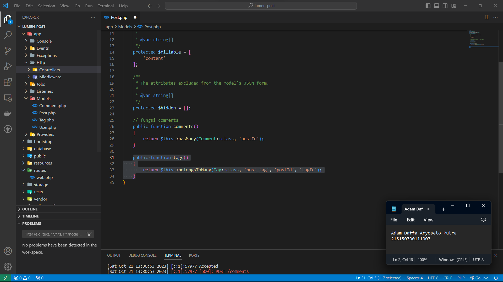
2. Tambahkan fungsi posts() pada file Tag.php
    ```
    <?php

    namespace App\Models;

    use Illuminate\Database\Eloquent\Model;

    class Tag extends Model
    {
        ...
        public function posts()
        {
            return $this->belongsToMany(Post::class, 'post_tag', 'tagId', 'postId');
        }
    }
    ```
    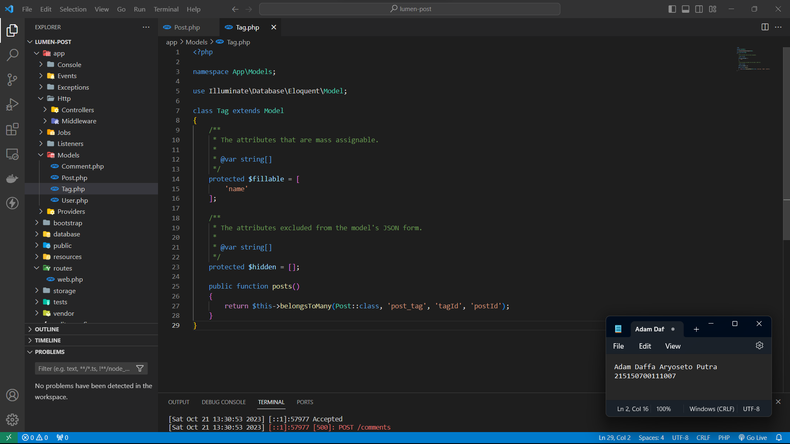
3. Buatlah file TagController.php dan isilah dengan baris kode berikut
    ```
    <?php

    namespace App\Http\Controllers;

    use App\Models\Tag;
    use Illuminate\Http\Request;

    class TagController extends Controller
    {
        /**
        * Create a new controller instance.
        *
        * @return void
        */
        public function __construct()
        {
            //
        }
        
        //
        public function createTag(Request $request)
        {
            $tag = Tag::create([
                'name' => $request->name
            ]);

            return response()->json([
                'success' => true,
                'message' => 'New tag created',
                'data' => [
                    'tag' => $tag
                ]
            ]);
        }
    }
    ```
    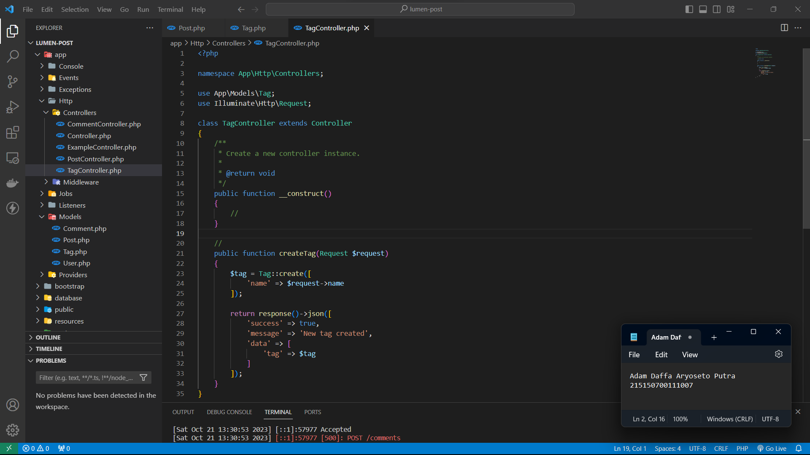
4. Tambahkan fungsi addTag dan response tags pada PostController.php
    ```
    <?php

    namespace App\Http\Controllers;

    use App\Models\Post;
    use Illuminate\Http\Request;

    class PostController extends Controller
    {
        ...
        public function getPostById(Request $request)
        {
            $post = Post::find($request->id);

            return response()->json([
                'success' => true,
                'message' => 'All post grabbed',
                'data' => [
                    'post' => [
                        'id' => $post->id,
                        'content' => $post->content,
                        'comments' => $post->comments,
                        'tags' => $post->tags, //response tags
                    ]
                ]
            ]);
        }

        public function addTag(Request $request)
        {
            $post = Post::find($request->id);
            $post->tags()->attach($request->tagId);
            return response()->json([
                'success' => true,
                'message' => 'Tag added to post',
            ]);
        }
    }
    ```
    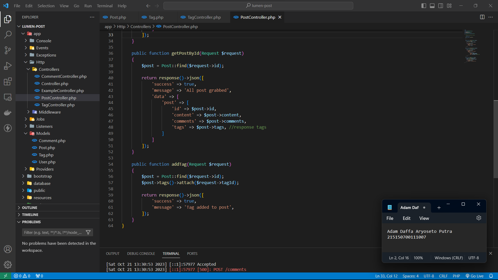
5. Tambahkan baris berikut pada routes/web.php
    ```
    $router->group(['prefix' => 'posts'], function () use ($router) {
        $router->post('/', ['uses' => 'PostController@createPost']);
        $router->get('/{id}', ['uses' => 'PostController@getPostById']);
        $router->put('/{id}/tag/{tagId}', ['uses' => 'PostController@getPostById']); //
    });
    ...
    $router->group(['prefix' => 'tags'], function () use ($router) {
        $router->post('/', ['uses' => 'TagController@createTag']);
    });
    ```
    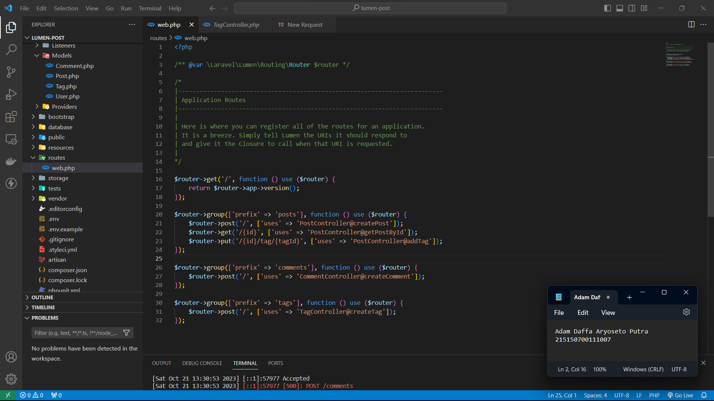
6. Buatlah satu tag menggunakan Postman
    
7. Tambahkan tag “jadul” pada post “disana engkau berdua”
    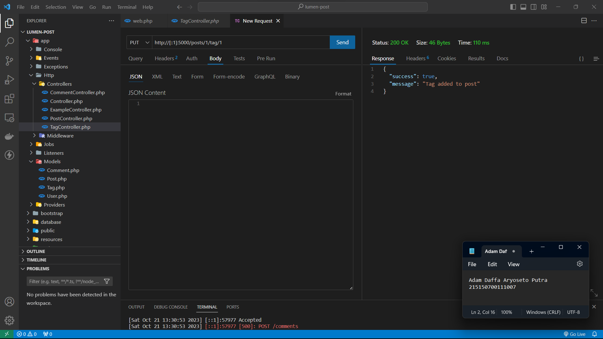
8. Tampilkan post “disana engkau berdua” menggunakan Postman
    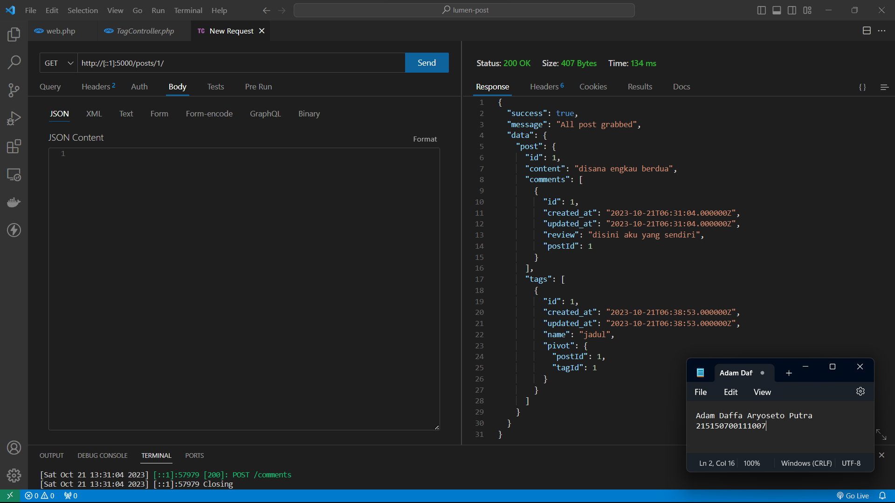
9. Buatlah postingan “tanpamu apa artinya” menggunakan Postman
    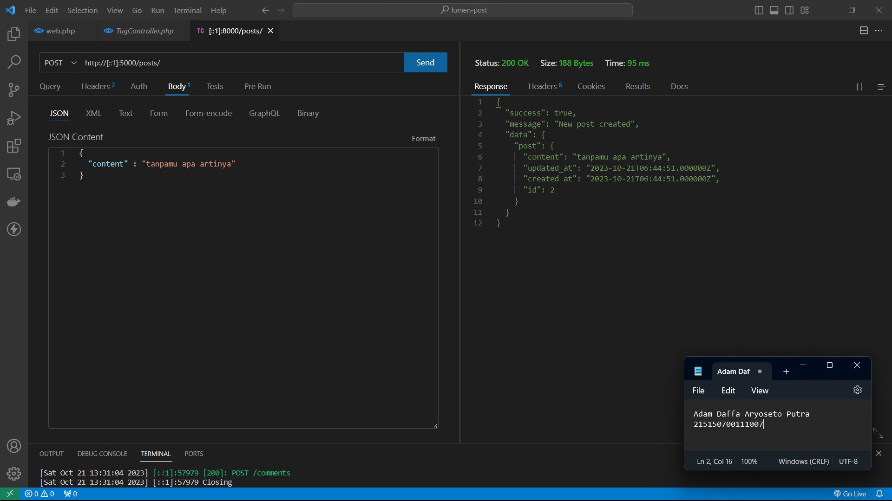
10. Tambahkan tag “jadul” pada postingan “tanpamu apa artinya”
    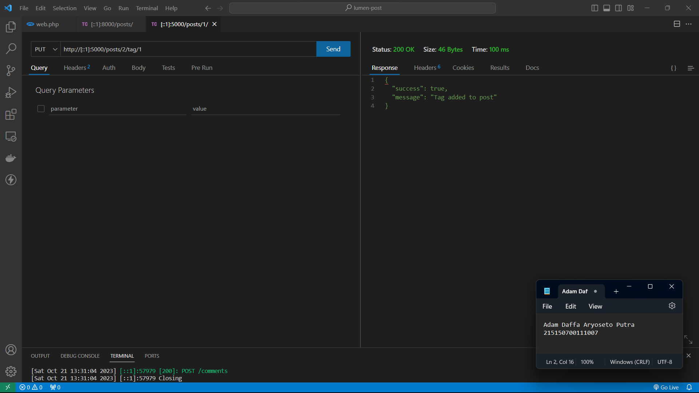
11. Buatlah tag “lagu” menggunakan Postman
    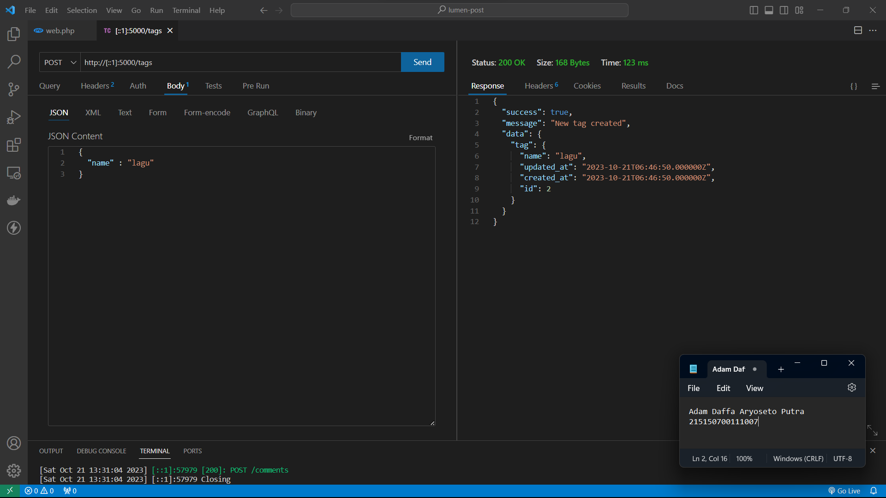
12. Tambahkan tag “lagu” pada postingan “tanpamu apa artinya”
    
13. Tampilkan post pertama
    
14. Tampilkan post kedua
    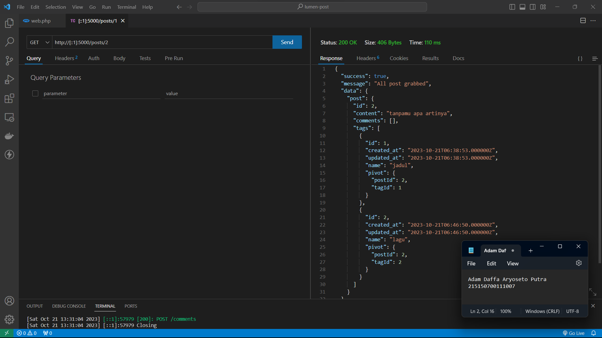

:bulp: 
> Tag “jadul” yang berada pada dua post menunjukkan **satu** tag dapat berada di **banyak** post

> Post “tanpamu apa artinya” yang memiliki dua tag menunjukkan **satu** post dapat memiliki banyak **tag**


    