# :globe_with_meridians: Praktikum 8 : Register, Authentication dan Authorization
Dibawah ini merupakan langkah pengerjaan praktikum serta hasil screenshot pengerjaan Praktikum Modul 8 saya mengenai Register, Authentication dan Authorization.

## :scroll: Dasar Teori
* ### Authentication
    Otentifikasi adalah proses untuk mengenali identitas dengan mekanisme pengasosiasian permintaan yang masuk dengan satu set kredensial pengidentifikasi. Kredensial yang diberikan akan dibandingkan dengan database informasi pengguna yang berwenang di dalam sistem operasi lokal atau server otentifikasi.

* ### Token
    Token merupakan nilai yang digunakan untuk mendapatkan akses ke sumber daya yang dibatasi secara elektronik. Penggunaan token ditujukan pada web service yang tidak menyimpan state yang berkaitan dengan penggunaan aplikasi (stateless) seperti session.

* ### Authorization
    Authorization merupakan proses pemberian hak istimewa yang dilakukan setelah proses authentication. Setelah pengguna diidentifikasi pada proses authentication, authorization akan memberikan hak istimewa dan tindakan yang diizinkan kepada pengguna yang ditentukan.
   

## :footprints: Langkah Percobaan
* ### Register 
    1. Pastikan terdapat tabel users yang dibuat menggunakan migration pada bab 3 <u>Basic Routing dan Migration</u> . Berikut informasi kolom yang harus ada
        |  |  
        | ----------- | 
        | id |
        | createdAt | 
        | updatedAt | 
        | name | 
        | email | 
        | password |

        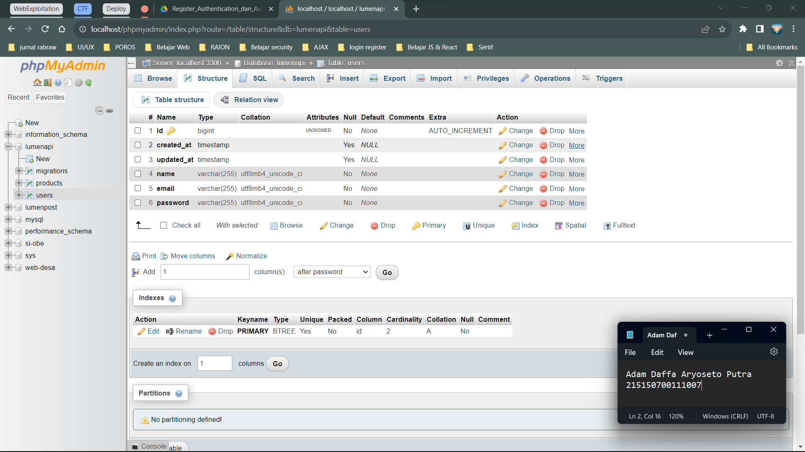

    2. Pastikan terdapat model User.php yang digunakan pada bab 5 <u>Model, Controller dan Request-Response Handler</u> . Berikut baris kode yang harus ada
        ```
        <?php

        namespace App\Models;

        use Illuminate\Database\Eloquent\Model;

        class User extends Model
        {
            /**
            * The attributes that are mass assignable.
            *
            * @var array
            */
            protected $fillable = [
                'name', 'email', 'password'
            ];

            /**
            * The attributes excluded from the model's JSON form.
            *
            * @var array
            */
            protected $hidden = [];
        }
        ```
        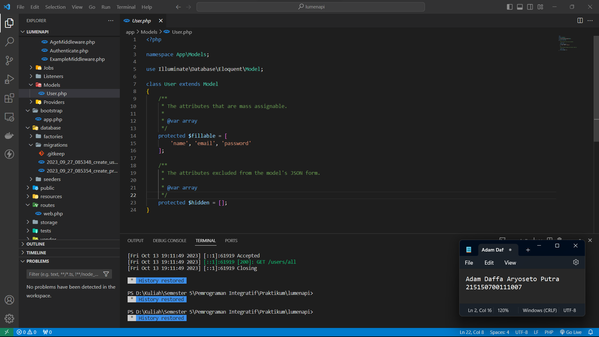

    3. Buatlah file AuthController.php dan isilah dengan baris kode berikut
        ```
        <?php
        
        namespace App\Http\Controllers;
        
        use App\Models\User;
        use Illuminate\Http\Request;
        use Illuminate\Support\Facades\Hash;
        
        class AuthController extends Controller
        {
            /**
            * Create a new controller instance.
            *
            * @return void
            */
            public function __construct()
            {
                //
            }
            
            //
            public function register(Request $request)
            {
                $name = $request->name;
                $email = $request->email;
                $password = Hash::make($request->password);
                
                $user = User::create([
                    'name' => $name,
                    'email' => $email,
                    'password' => $password
                ]);

                return response()->json([
                    'status' => 'Success',
                    'message' => 'new user created',
                    'data' => [
                        'user' => $user,
                    ]
                ],200);
            }
        }
        ```
        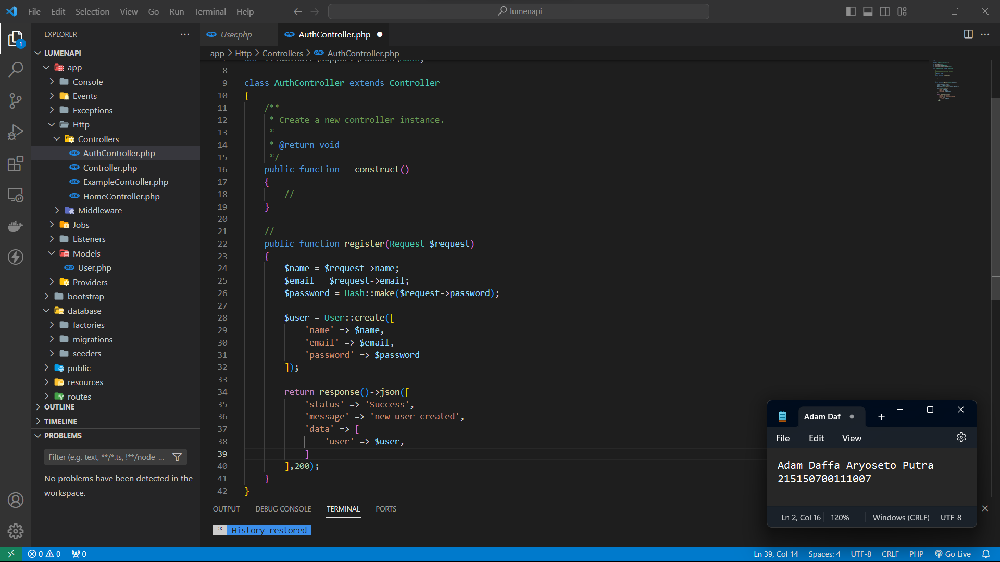
    
    4. Tambahkan baris berikut pada routes/web.php
        ```
        <?php

        ...
        
        $router->group(['prefix' => 'auth'], function () use ($router) {
            $router->post('/register', ['uses'=> 'AuthController@register']);
        });
        ```
        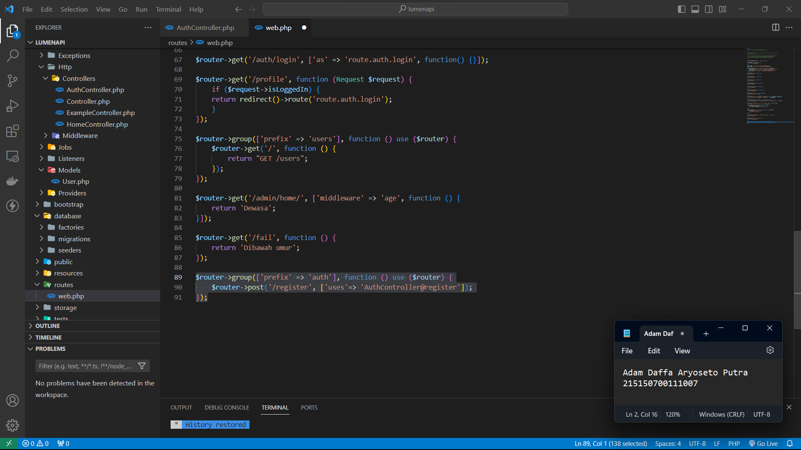

    5. Jalankan aplikasi pada endpoint /auth/register dengan body berikut
        ```
        {
            "name": "Scaramouche",
            "email": "scaramouche@fatui.org",
            "password": "wanderer"
        }
        ```
        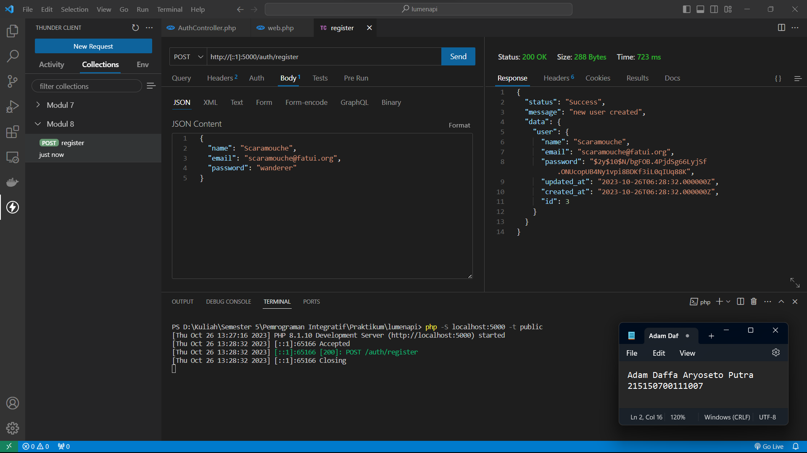

* ### Authentication
    1. Buatlah fungsi login(Request $request) pada file AuthController.php
        ```
        <?php

        namespace App\Http\Controllers;

        use App\Models\User;
        use Illuminate\Http\Request;
        use Illuminate\Support\Facades\Hash;

        class AuthController extends Controller
        {

            ...

            public function login(Request $request)
            {
                $email = $request->email;
                $password = $request->password;
                
                $user = User::where('email', $email)->first();
                
                if (!$user) {
                    return response()->json([
                        'status' => 'Error',
                        'message' => 'user not exist',
                    ],404);
                }

                if (!Hash::check($password, $user->password)) {
                    return response()->json([
                        'status' => 'Error',
                        'message' => 'wrong password',
                    ],400);
                }

                return response()->json([
                    'status' => 'Success',
                    'message' => 'successfully login',
                    'data' => [
                        'user' => $user,
                    ]
                ],200);
            }
        }
        ```
        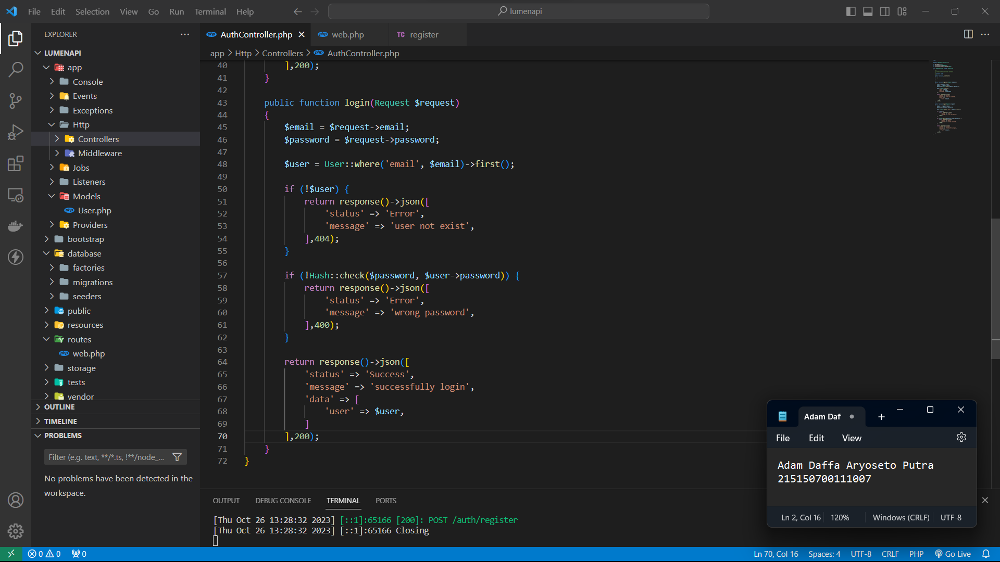

    2. Tambahkan baris berikut pada routes/web.php
        ```
        <?php
        
        ...
        
        $router->group(['prefix' => 'auth'], function () use ($router) {
            $router->post('/register', ['uses'=> 'AuthController@register']);
            $router->post('/login', ['uses'=> 'AuthController@login']); // route login
        });
        ```
        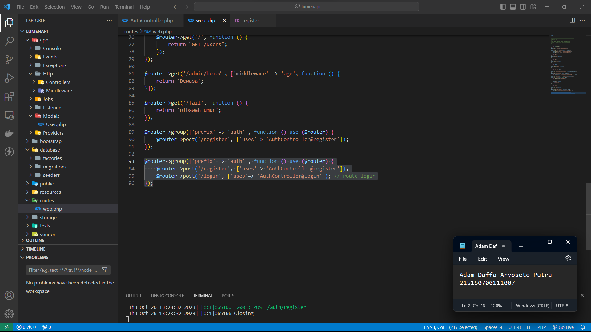

    3. Jalankan aplikasi pada endpoint /auth/login dengan body berikut
        ```
        {
            "email": "scaramouche@fatui.org",
            "password": "wanderer"
        }
        ```
        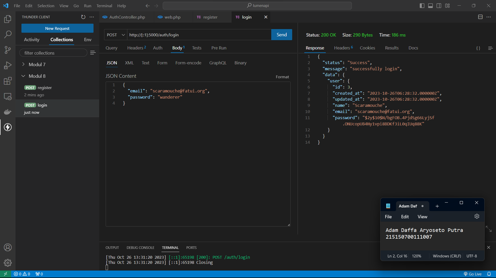
        > :bulb: Opsional : lakukan percobaan dengan menyalahkan email atau password dan amati responnya.
        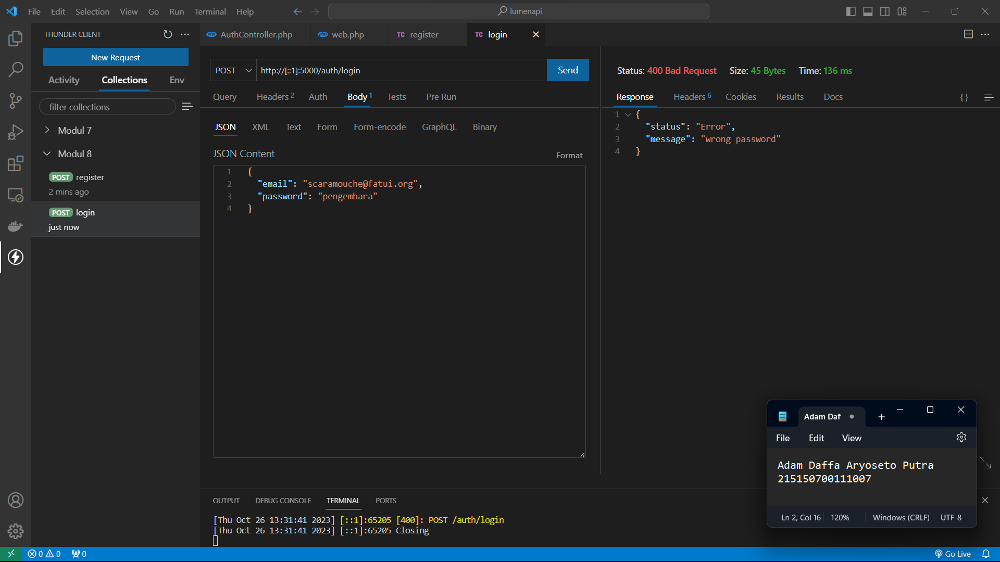


* ### Token
    1. Jalankan perintah berikut untuk membuat migrasi baru
        ```
        php artisan make:migration add_column_token_to_users
        ```
        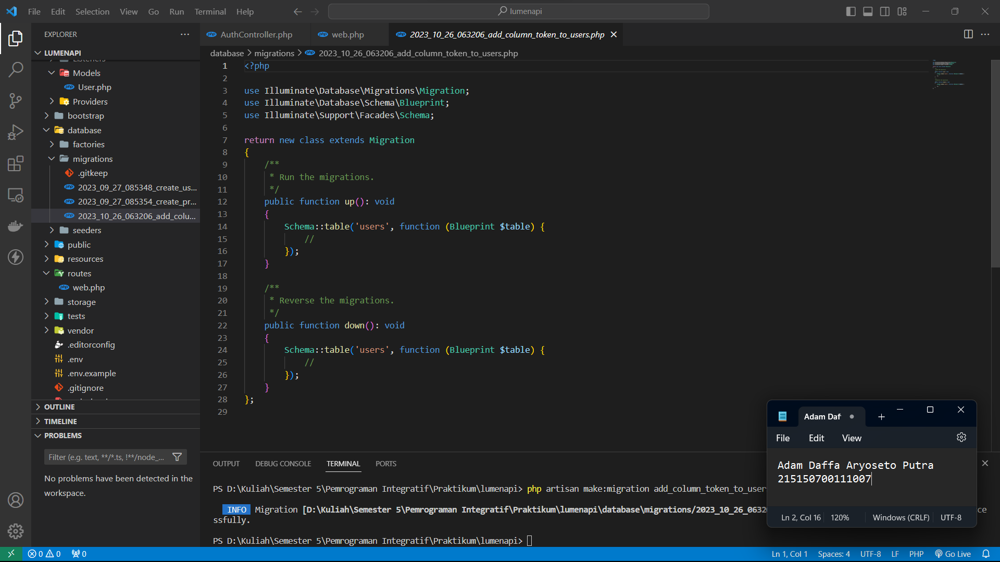

    2. Tambahkan baris berikut pada migration yang baru terbuat
        ```
        <?php

        use Illuminate\Database\Migrations\Migration;
        use Illuminate\Database\Schema\Blueprint;
        use Illuminate\Support\Facades\Schema;
        
        class AddColumnTokenToUsers extends Migration
        {
            /**
            * Run the migrations.
            *
            * @return void
            */
            public function up()
            {
                Schema::table('users', function (Blueprint $table) {
                    $table->string('token', 72)->unique()->nullable(); //
                });
            }
            /**
            * Reverse the migrations.
            *
            * @return void
            */
            public function down()
            {
                Schema::table('users', function (Blueprint $table) {
                    $table->dropIfExists('token'); //
                });
            }
        }
        ```
        

    3. Tambahkan atribut token di $fillable pada User.php
        ```
        <?php
        
        namespace App\Models;
        
        use Illuminate\Database\Eloquent\Model;
        
        class User extends Model
        {
            /**
            * The attributes that are mass assignable.
            *
            * @var array
            */
            protected $fillable = [
                'name', 'email', 'password',
                'token' //
            ];
            
            /**
            * The attributes excluded from the model's JSON form.
            *
            * @var array
            */
            protected $hidden = [];
        }
        ```
        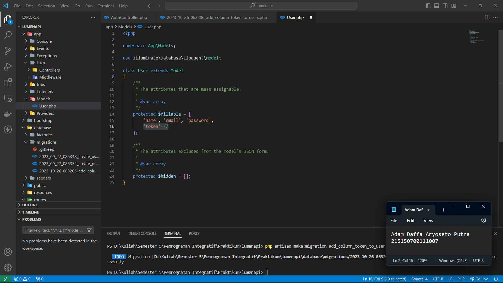
    
    4. Tambahkan baris berikut pada file AuthController.php 
        ```
        <?php
    
        namespace App\Http\Controllers;
    
        use App\Models\User;
        use Illuminate\Http\Request;
        use Illuminate\Support\Facades\Hash;
        use Illuminate\Support\Str;
    
        class AuthController extends Controller
        {

            ...

            public function login(Request $request)
            {
                $email = $request->email;
                $password = $request->password;
                
                $user = User::where('email', $email)->first();
                
                if (!$user) {
                    return response()->json([
                        'status' => 'Error',
                        'message' => 'user not exist',
                    ],404);
                }

                if (!Hash::check($password, $user->password)) {
                    return response()->json([
                        'status' => 'Error',
                        'message' => 'wrong password',
                    ],400);
                }

                $user->token = Str::random(36); //
                $user->save(); //
                
                return response()->json([
                    'status' => 'Success',
                    'message' => 'successfully login',
                    'data' => [
                        'user' => $user,
                    ]
                ],200);
            }
        }
        ```
        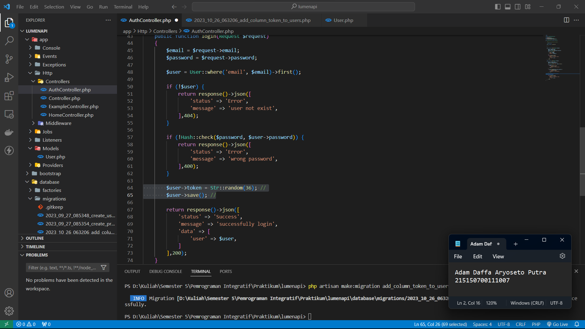

    5. Jalankan perintah di bawah untuk menjalankan migrasi terbaru
        ```
        php artisan migrate
        ```
        

    6. Jalankan aplikasi pada endpoint /auth/login dengan body berikut. Salinlah token yang didapat ke notepad
        ```
        {
            "email": "scaramouche@fatui.org",
            "password": "wanderer"
        }
        ```
        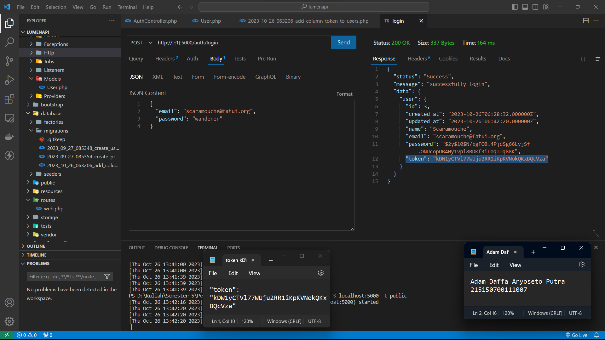

* ### Authorization
    1. Buatlah file Authorization.php pada folder App/Http/Middleware dan isilah dengan baris berikut
        ```
        <?php
        
        namespace App\Http\Middleware;
        
        use App\Models\User;
        use Closure;
        
        class Authorization
        {
            /**
             * Handle an incoming request.
             *
             * @param \Illuminate\Http\Request $request
             * @param \Closure $next
             * @return mixed
             */
            public function handle($request, Closure $next)
            {
                $token = $request->header('token') ?? $request->query('token');
                if (!$token) {
                    return response()->json([
                        'status' => 'Error',
                        'message' => 'token not provided',
                    ],400);
                }

                $user = User::where('token', $token)->first();
                if (!$user) {
                    return response()->json([
                        'status' => 'Error',
                        'message' => 'invalid token',
                    ],400);
                }

                $request->user = $user;
                return $next($request);
            }
        }
        ```
        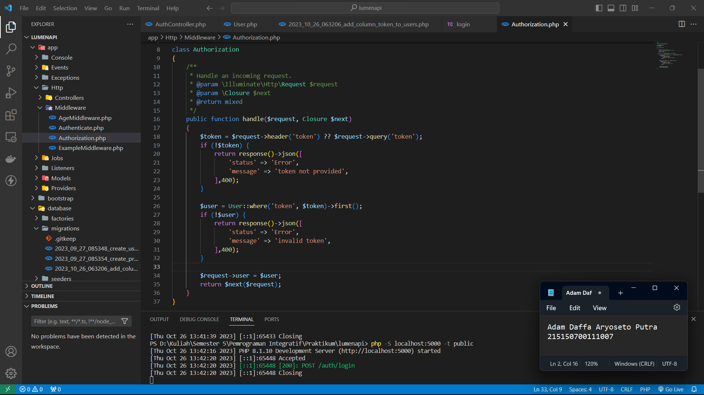

    2. Tambahkan middleware yang baru dibuat pada bootstrap/app.php.
        ```
        $app->routeMiddleware([
            'auth' => App\Http\Middleware\Authorization::class, //
        ]);    
        ```
        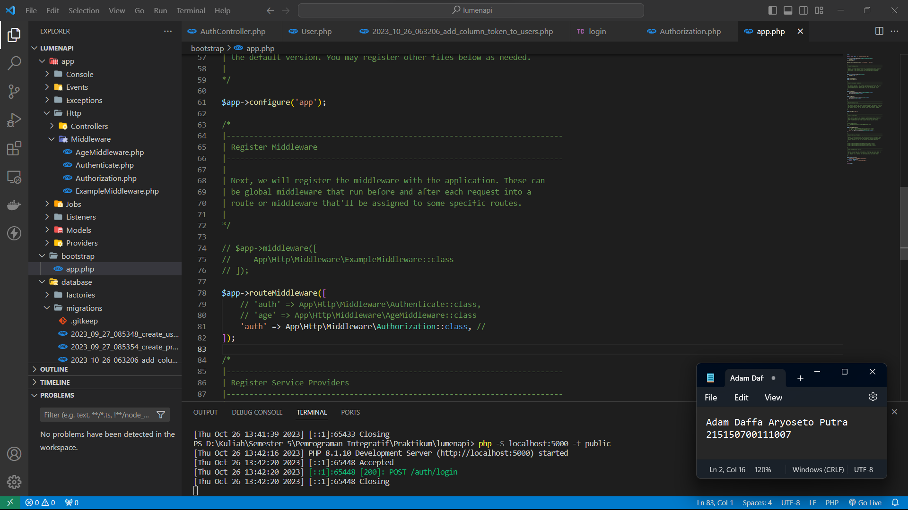

    3. Buatlah fungsi home() pada HomeController.php
            ```
            <?php

            namespace App\Http\Controllers;
            
            use App\Models\User; // import model User
            use Illuminate\Http\Request;
            use Illuminate\Http\Response;
            
            class HomeController extends Controller
            {

                ...
                
                public function home(Request $request)
                {
                    $user = $request->user;

                    return response()->json([
                        'status' => 'Success',
                        'message' => 'selamat datang ' . $user->name,
                    ],200);
                }
            }
            ```
            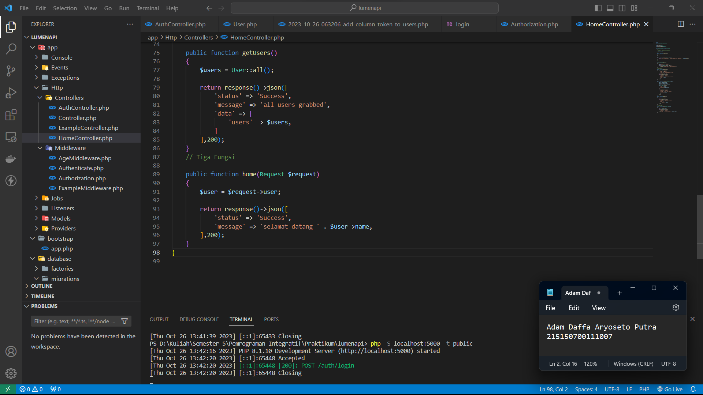

    4. Tambahkan baris berikut pada routes/web.php
        ```
        <?php

        $router->get('/', ['uses' => 'HomeController@index']);
        $router->get('/hello', ['uses' => 'HomeController@hello']);
        $router->get('/home', ['middleware' => 'auth','uses' => 'HomeController@home']); //

        ...
        ```
        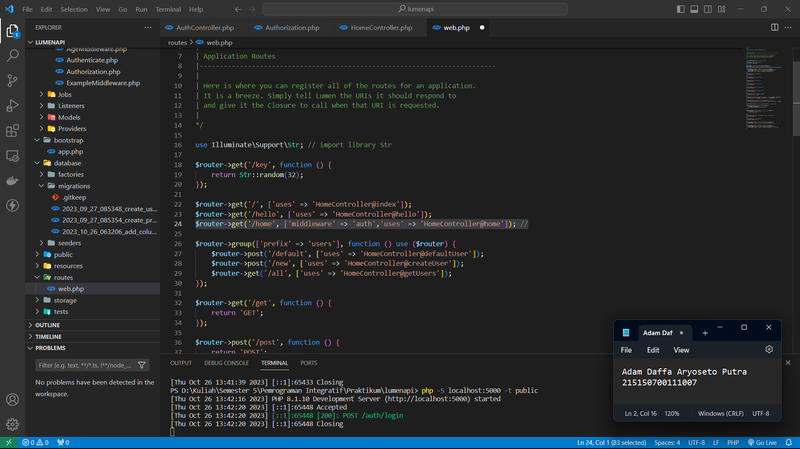

    5. Jalankan aplikasi pada endpoint /home dengan melampirkan nilai token yang didapat setelah login pada header
    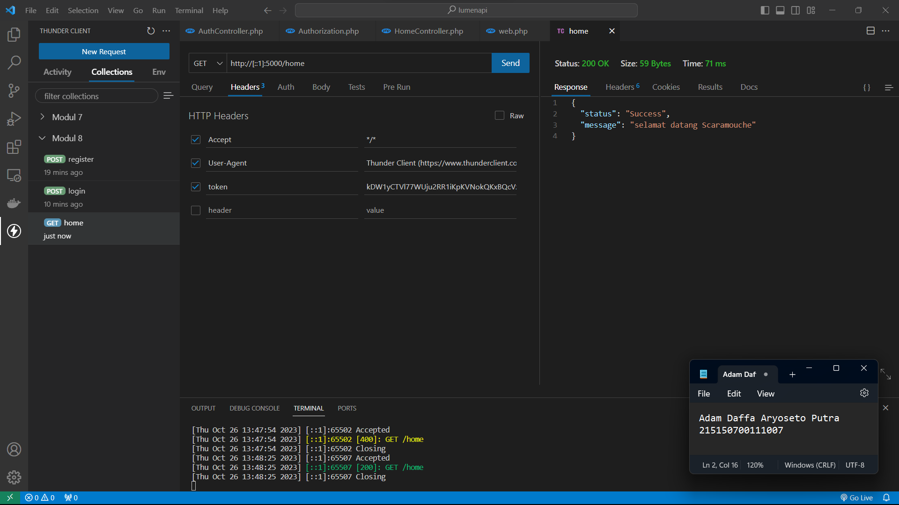


    